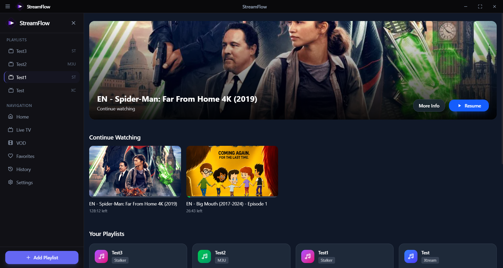
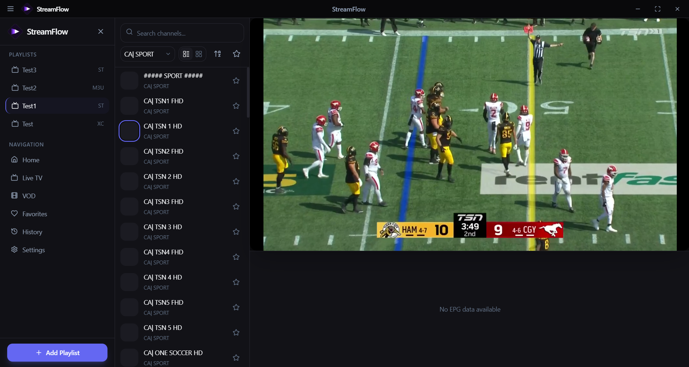
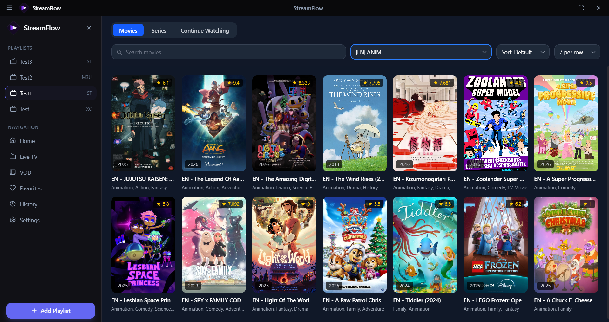
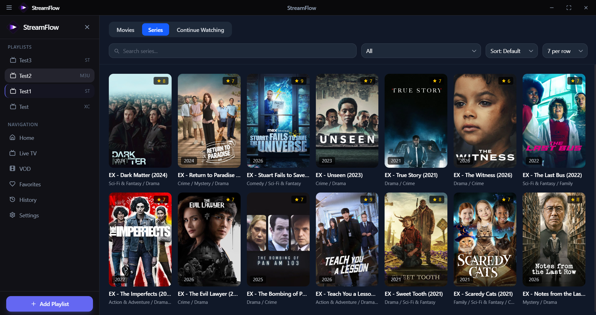
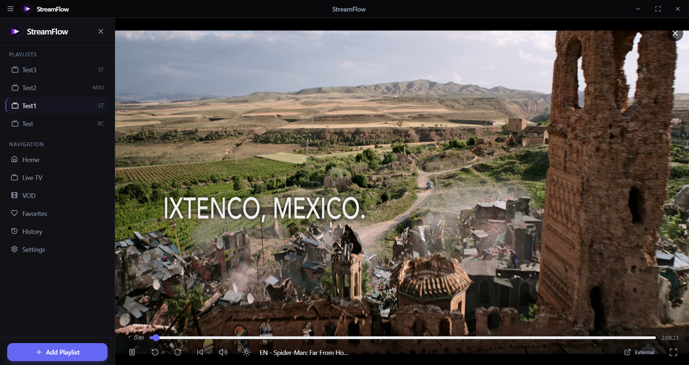

# StreamFlow

A modern desktop IPTV player built with **Tauri**, **SvelteKit**, and **Rust**. Connects to M3U, Xtream Codes, and Stalker/Ministra portals for Live TV, Movies, and Series in a single app.

## Screenshots

| Dashboard | Live TV |
|---|---|
|  |  |

| VOD — Movies | VOD — Series |
|---|---|
|  |  |

| Movie Playing |
|---|
|  |

## Features

- **Three provider types**: M3U playlists, Xtream Codes panels, and Stalker/Ministra portals (MAC-based auth) — all normalized into one unified Live TV / VOD experience.
- **Live TV**: channel search, group/category filtering with a switchable list-or-category-browse layout, EPG with "watch from start" catch-up, channel-number zapping.
- **Movies & Series**: category browsing, portal-wide search, resume/continue-watching, auto-advance to the next episode, season/episode navigation.
- **Multiple playback engines**: native HTML5 video with HLS.js/mpegts.js, an embedded mpv fallback for containers the browser can't demux (e.g. MKV/HEVC), and launching external mpv/VLC.
- **Downloads**: save VOD content locally for offline viewing.
- **Favorites & watch history**, a default-playlist launch option, dark/light/system theming, and support for 19 languages.

## Platform Support

Prebuilt installers are published on the [Releases](../../releases) page for every tagged version.

| Platform | Installer | Embedded MKV/HEVC playback |
|---|---|---|
| Windows | `.exe` / `.msi` | ✅ |
| Linux | `.deb` / `.rpm` / `.AppImage` | ✅ (requires an X11 session or XWayland — forced automatically even on Wayland desktops) |
| macOS (Apple Silicon) | `.dmg` | ✅ |
| macOS (Intel) | — not published — | — |

External playback via mpv/VLC (if installed) works on every platform regardless of the table above — only the *embedded* in-app player has these constraints.

Embedded playback on Linux and macOS is new and builds clean in CI, but hasn't yet been extensively verified on real hardware — if something looks off there (video not appearing, overlay controls not clickable), please [open an issue](../../issues).

## Getting Started

### Prerequisites

- [Node.js](https://nodejs.org/) 18+
- [Rust](https://www.rust-lang.org/tools/install) (stable toolchain, 1.77+)
- Platform build tools for [Tauri](https://tauri.app/start/prerequisites/) (on Windows: MSVC Build Tools + WebView2)

### Development

```bash
npm install
npm run tauri dev
```

### Building a release

```bash
npm run tauri build
```

Always build through the Tauri CLI (`npm run tauri build`), not `cargo build --release` directly — the Rust build alone skips the frontend build step (`npm run build`) that `tauri.conf.json`'s `beforeBuildCommand` normally runs, producing a binary with no frontend to load.

## Tech Stack

- **Frontend**: SvelteKit + Svelte 5 (runes), TypeScript, Tailwind CSS
- **Backend**: Rust, Tauri 2, SQLite (via `r2d2`/`rusqlite`, WAL mode), `reqwest`, `axum` (local stream proxy)
- **Playback**: HLS.js, mpegts.js, embedded `libmpv2`

See [ARCHITECTURE.md](ARCHITECTURE.md) for how the pieces fit together.

## Contributing

Contributions are welcome — see [CONTRIBUTING.md](CONTRIBUTING.md) for dev setup and guidelines.

## License

[MIT](https://github.com/jakk-er/streamflow/blob/main/LICENSE)

## Disclaimer

StreamFlow is a media player only. It does not host, provide, index, or distribute any streams, channels, or content, and no content is bundled with the app. It is designed to connect to IPTV sources (M3U playlists, Xtream Codes panels, Stalker/Ministra portals) that you provide.

You are solely responsible for ensuring you have the legal right to access and use any content through any source you configure with this app, and for complying with your local laws. The developer(s) assume no liability for misuse of this software.
